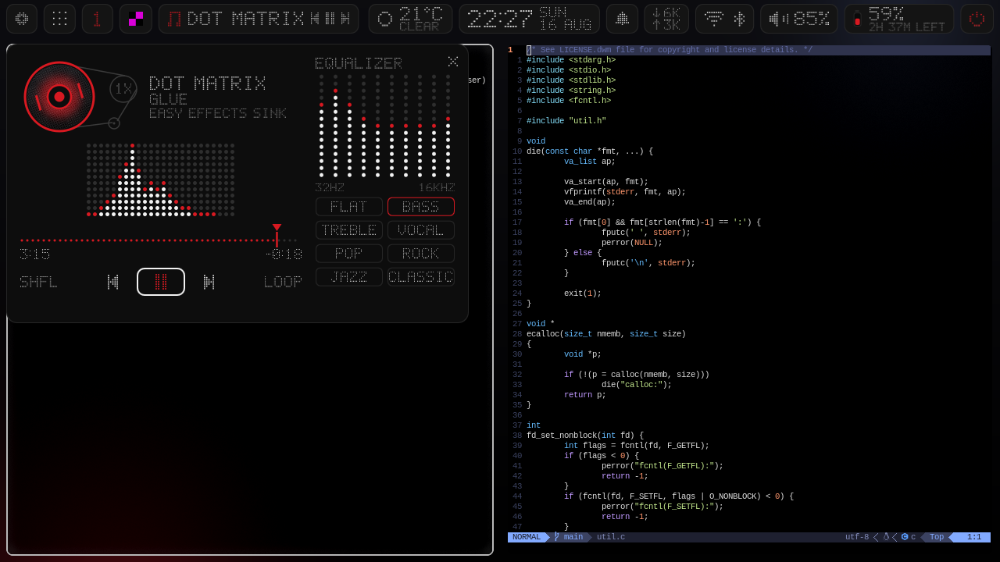
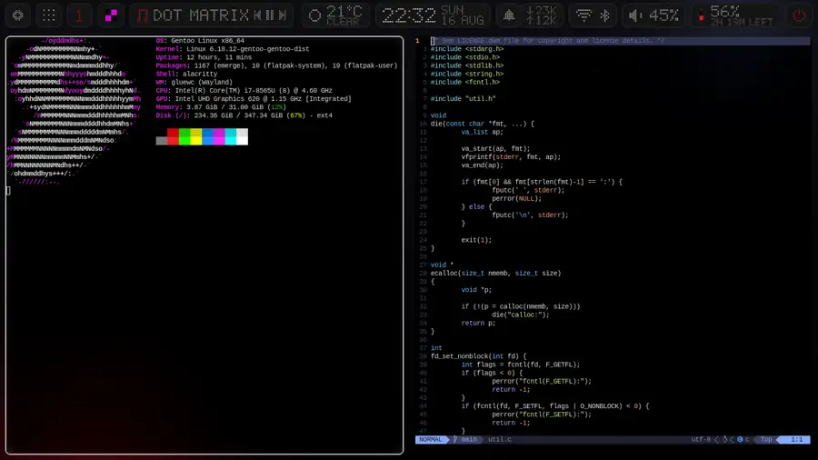
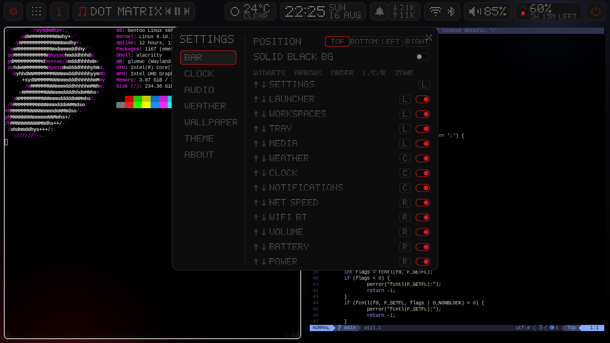
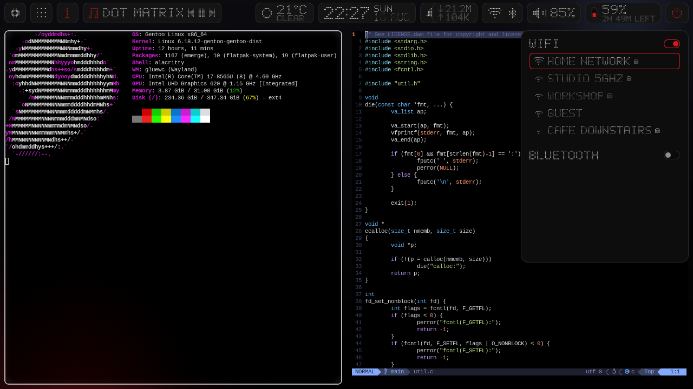
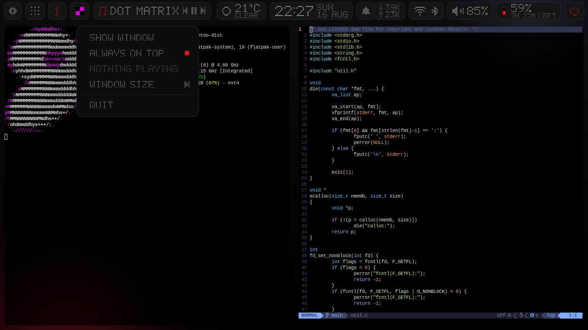
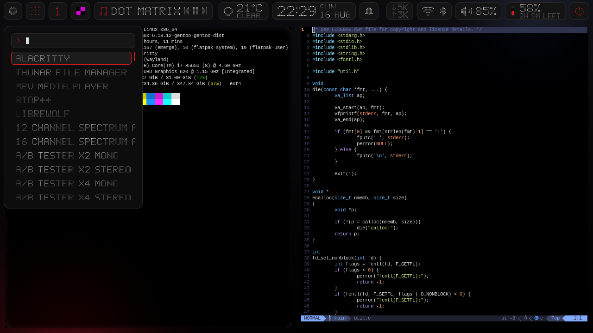
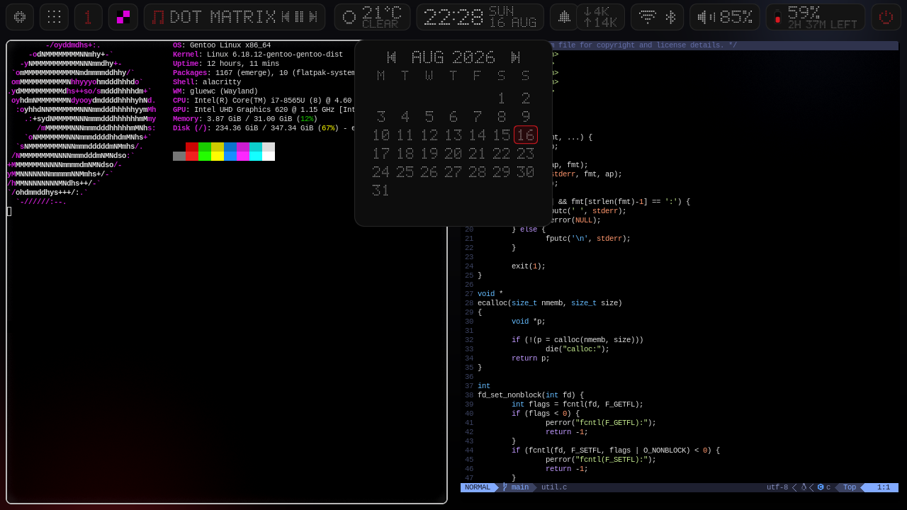
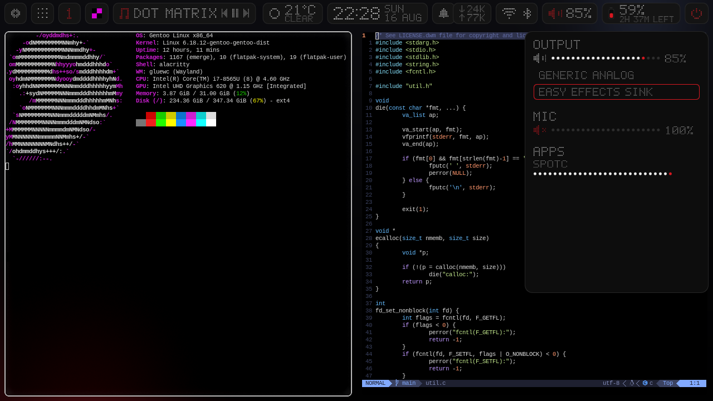
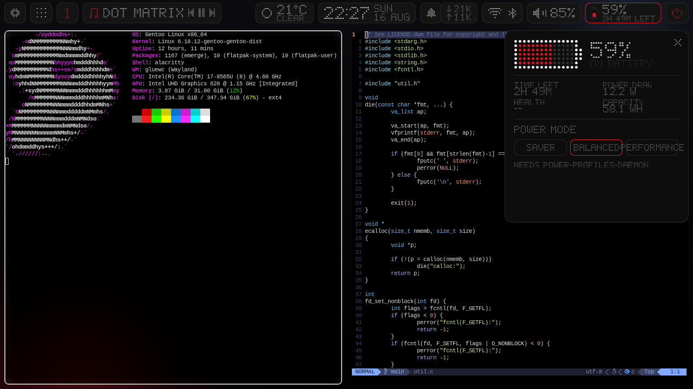
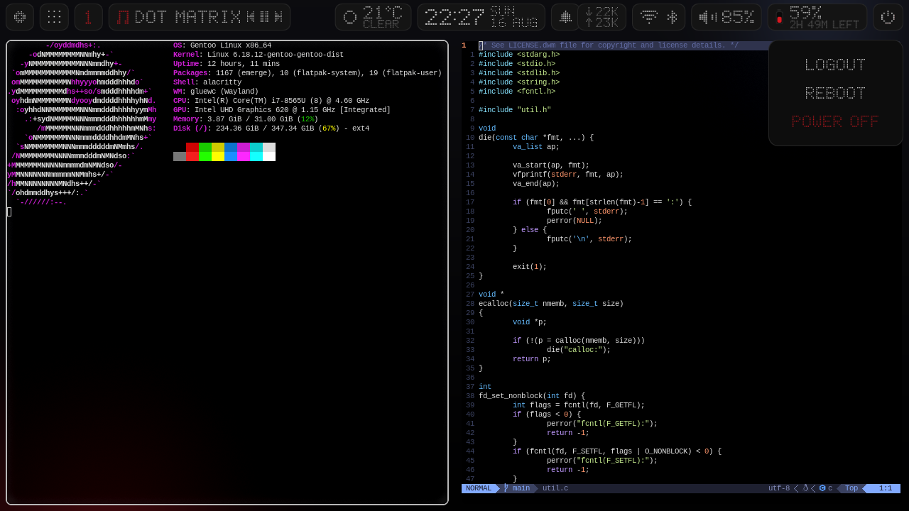

# glueqs

[](LICENSE)
[](https://quickshell.org/)

glueqs is a desktop shell for [Quickshell](https://quickshell.org/), drawn in a
dot-matrix style: every label, number and icon is a grid of round dots rendered
on a canvas, on black with a single accent colour. It is the shell written
alongside [gluewc](https://github.com/vladbiber/gluewc) and the one that
compositor is developed against.



*The media panel: the reel disc carries the album art, the dots are the live
spectrum, and the right column is a 10-band EasyEffects equalizer.*



*The bar stays put while the compositor's overview opens; the dash below it
only exists while the overview is up.*

## What is in it

A bar on any screen edge, with widgets placed by three ordered zone lists, and
a panel behind most of them:

| Widget | Left click | Also |
| --- | --- | --- |
| `settings` | Settings panel: bar, clock, audio, weather, wallpaper, theme | |
| `wallpaper` | (not a widget) The picker on `Super+W`; the shell paints the wallpaper itself | |
| `launcher` | App launcher: type to filter, Enter or click to launch | |
| `workspaces` | Switch to that workspace | Occupied ones show, empty ones hide; read from gluewc's state file, switched through `gluewc-msg`, so no extra Quickshell module is needed |
| `tray` | Activate the app | Middle click: secondary action. **Right click: the app's own menu, quit included** |
| `media` | Expanded player: spinning disc, dot equalizer, dotted timeline, 10-band EasyEffects EQ | Prev/play/next on the tile itself |
| `weather` | Forecast panel | Current conditions from wttr.in |
| `clock` | Month calendar, today boxed in the accent | 12h/24h, optional date |
| `notifs` | Notification history | Toasts appear on their own |
| `netspeed` | Live up/down rates | Read from `/proc/net/dev` |
| `network` | Wi-Fi list with connect and password entry, Bluetooth toggle and devices | |
| `volume` | Mixer: output devices, mic and per-app streams | Right click mutes, wheel changes volume |
| `battery` | Charge, health, power draw, time left and power profiles | Hidden when there is no battery |
| `power` | Session menu: logout, reboot, power off | Each entry arms first, then runs |



*Settings: every widget can be moved between the three zones, reordered or
switched off, and the whole thing is written back to `settings.json`.*



*Networks, with the connected one boxed in the accent; the lock marks the ones
that will ask for a password. Bluetooth sits underneath.*



*Right click on a tray icon opens the app's own menu — checkboxes, disabled
entries, submenus and quit — drawn in the shell's own style.*



*The launcher: type to filter, most-launched first.*

Plus the parts that appear on their own:

- Volume and brightness OSDs, with a configurable dwell time
- Notification toasts, with a full notification server behind them
- An overview dash — pinned apps, running apps, and an apps grid you can pin
  from — that appears while the compositor's overview is up
- A dot font that falls back to a plain Nerd Font label at the same cap height,
  so every widget keeps its layout with the dot rendering switched off

The rest of the panels, in the same order as the bar:

| | |
| --- | --- |
|  |  |
| Calendar, today boxed in the accent | Mixer: outputs, mic and per-app streams |
|  |  |
| Battery, health and power profiles | Session menu, each entry arms before it runs |

## Requirements

Quickshell is the only hard requirement; everything else is per feature and
degrades to a widget that simply does not appear.

| For | Needs |
| --- | --- |
| The shell itself | [Quickshell](https://quickshell.org/) 0.2 or newer with Qt 6 — the one your distribution packages is fine |
| Workspaces | gluewc, which writes `$XDG_STATE_HOME/gluewc/workspaces` and installs `gluewc-msg` |
| Overview dash | gluewc, which publishes its overview state to `$XDG_STATE_HOME/gluewc/overview` |
| Live spectrum in the media panel | The `PwAudioSpectrum` type, which only the noctalia-qs fork of Quickshell has; without it the panel animates a synthetic equalizer |
| Volume, media, tray, notifications, Bluetooth | PipeWire, and the MPRIS, SNI and notification services Quickshell already speaks |
| Wi-Fi and Bluetooth panels | `nmcli`, `bluetoothctl` |
| Weather | `curl`, and a location set in the settings panel |
| Brightness | A backlight under `/sys/class/backlight`, plus `udevadm` to follow external changes |
| Equalizer presets | `easyeffects` |
| Wallpaper | Nothing: the shell paints it itself, on a background layer per screen |
| Wallpaper palettes and terminal colours | Python 3.11+ and Pillow; matugen is optional for Material styles |
| Session menu | `loginctl` |

## Shared theme colours

Settings → THEME can sync GlueWC window borders, Alacritty and Kitty with the
bar. Alacritty and window borders follow the theme by default; Kitty is opt-in.
DETECT finds installed terminals and their usual config files; APPLY updates the
enabled ones. Turn off **Sync terminal text colours** to change only the
background and retain the current foreground, ANSI colours, cursor and selection.
Opacity, fonts, bindings and imports are preserved. Before the first config edit,
a `.pre-glueqs` backup is saved beside the original (or the symlink target).
Alacritty uses its normal live config reload; Kitty receives SIGUSR1. A custom
`--config` launch or disabled live reload may need a manual reload. Turning sync
off keeps the last palette and lets you edit colours yourself again.

**From wallpaper** defaults to Faithful, with Soft, Vibrant, Muted and Monochrome
variants. The extractor ranks colours by their area in the image, keeps grey
images neutral and adjusts perceptual lightness for readable dark/light palettes.
Choose a source swatch for another variant, or a source monitor when displays use
different wallpapers. Changes automatically reach the bar, borders and enabled
terminals. Material styles use matugen with the selected source colour; they do
not require an interactive colour prompt. If extraction fails, the previous
palette remains and the Theme page shows the error.

Inspect the active palette with `qs -c glueqs ipc call glueqs themeinfo`.
Run colour/config regression tests with `python3 -m unittest discover -s tests`;
`python3 tests/run_runtime.py` exercises the real QML services offscreen, including
rapid wallpaper changes, terminal output and workspace-file write races.

## Install

The gluewc installer does all of it, on every distribution it knows:

```sh
curl -fsSL https://raw.githubusercontent.com/vladbiber/gluewc/main/install.sh | sh -s -- --with-bar
```

That installs Quickshell (from the distribution, or built from source where
there is no package), the tools the panels use, clones this repository into
`~/.config/quickshell/glueqs` and adds the autostart line below.

By hand, the repository *is* the Quickshell config directory:

```sh
git clone https://github.com/vladbiber/glueqs.git ~/.config/quickshell/glueqs
qs -c glueqs
```

To start it with the session, under gluewc in `~/.config/gluewc/config.conf`:

```ini
autostart = qs -c glueqs
```

On NixOS and finix the shell is a package: `nix run github:vladbiber/glueqs`
tries it, and gluewc's module installs it with `programs.gluewc.bar.enable =
true`, which puts a `glueqs` command on PATH (Quickshell from nixpkgs, the QML
under `share/glueqs`) and seeds new accounts with `autostart = glueqs`. The
settings file lives in `~/.config/glueqs/settings.json`, so the read-only
store path is not a problem.

Any other compositor works the same way through its own autostart; the
workspace strip and the overview dash are the only parts that will stay away.

## Settings

The settings panel writes `settings.json` to `$XDG_CONFIG_HOME/glueqs/`
(`~/.config/glueqs/settings.json`), not next to the QML, so the shell itself
can live somewhere read-only such as a distribution package or the Nix store.
A `settings.json` left next to the QML by an older version is copied over
once. The file is watched, so editing it by hand applies immediately as well.

The panel has a page per topic: BAR (position, the widgets and their zones),
CLOCK, AUDIO, WEATHER, WALLPAPER, DISPLAY (backlight and sleep mode), THEME
and ABOUT. Rows that belong together share one card; separate concerns get a
gap.
Under gluewc it grows a GLUEWC entry that opens the compositor's own settings
(see below).

| Key | Meaning |
| --- | --- |
| `barPosition` | `top`, `bottom`, `left`, `right` |
| `barLeft`, `barCenter`, `barRight` | Ordered widget names, comma separated |
| `barSolid` | Solid black bar instead of floating tiles |
| `accent` | Accent colour, `#rrggbb` |
| `scale` | UI scale, clamped to 0.8–1.4 |
| `dotFont` | Dot matrix text, or a plain font at the same size |
| `show*` | One switch per widget (`showLevels`, `showBrightness` included) |
| `idleOffMin`, `idleSuspendMin`, `idleNotWhileMedia` | Sleep mode: minutes idle before the backlight goes to 0 and before suspend (0 = never), and whether to wait for media to stop |
| `clock12h`, `showDate` | Clock format |
| `osdEnabled`, `osdDuration` | Volume and brightness OSDs |
| `volumeStep` | Wheel and key step, in percent |
| `weatherLocation`, `weatherInterval` | wttr.in query and refresh minutes |
| `eqEnabled`, `eqPreset`, `eqGains` | Media panel equalizer |
| `wallpaper`, `wallpaperPerMonitor` | The picture on every screen, and `name=path;name=path` overrides for single screens |
| `wallpaperDir` | The shuffle folder and where the picker starts, empty for `~/Pictures/Wallpapers` |
| `wallpaperFill` | `crop`, `fit`, `stretch`, `center` or `tile` |
| `wallpaperTransition`, `wallpaperTransitionMs` | `fade`, `wipe`, `slide`, `zoom` or `random`, and how long it takes |
| `wallpaperRandomMin` | Minutes between random picks from the folder, 0 for never |
| `wallpaperSolid` | The colour behind the picture, or alone when there is none |
| `dockPinned`, `dockUsage` | Overview dash pins and launch counts |

If `clock` is in the centre zone it is pinned to the exact centre of the screen
and its centre-zone neighbours flank it, so the time stays put no matter what
else is on the bar.

## Levels, brightness and sleep mode

The `levels` tile, on the right by default, shows volume and backlight side by
side and opens a panel with both: slider, presets, MUTE and a MIXER button on
the left, slider, presets and SCREEN OFF (0%) on the right. The wheel over the
tile changes the half under the pointer, shift+wheel is always the backlight,
right click mutes, middle click toggles the screen off. `volume` and
`brightness` remain as separate tiles for people who want them apart; an older
config with a `volume` tile gets `levels` in its place unless a `brightness`
tile was added on purpose.

The backlight is written through `brightnessctl`, then `light`, then the sysfs
file directly when that is writable. At 0% the tile stays in the bar so the
way back is one click, and the keys gluewc binds to `gluewc-backlight up`
bring the panel back as well. The tile's brightness half only appears when
`/sys/class/backlight` has a device.

SLEEP MODE lives on the settings panel's DISPLAY page (and on the gluewc
panel's DISPLAY page): after `idleOffMin` minutes without input the shell saves
the current level and writes 0; the first click or key restores it. After
`idleSuspendMin` minutes it runs `loginctl suspend` (or `systemctl suspend`,
or `zzz`); when none of those exists the row says so and stays disabled. With
"not while media plays" on, both wait for the player to stop and act then. It
uses the compositor's ext-idle-notify protocol through Quickshell's
`IdleMonitor`, respects idle inhibitors, and the card shows the current state:
armed, held by media, or off since a given time.

## gluewc settings

When the shell runs under gluewc (`XDG_CURRENT_DESKTOP=gluewc`, or the
compositor's state files exist) the settings panel gets a GLUEWC entry, and
`qs -c glueqs ipc call glueqs gluewc` opens the same thing from a key: a
wider panel with the compositor's whole configuration, read from and written
back to `~/.config/gluewc/config.conf` line by line. Comments and keys the
shell does not know survive; the compositor watches the file and applies a
save on the spot. Pages:

- APPEARANCE, ANIMATIONS, LAYOUT, INPUT: every scalar in `config.conf`, with
  the shipped default shown under each row and a RESET once a value differs.
- AUTOSTART: the commands run at login, as a list.
- KEYBINDS: SIMPLE names each bind in words ("Close window", "Volume up") with
  the keys as chips, grouped; EDIT opens a key-capture box (press the keys, or
  build the combo from SUPER / SHIFT / CTRL / ALT and a key name) and an
  action picker with the window manager actions, the installed applications
  (icon and name, becomes `spawn:` plus the Exec line) and a custom command.
  Conflicts are pointed out before saving. ADVANCED is the raw combo and
  action text. Combos gluewc already uses are taken by the compositor before
  they reach the capture box, so those are built with the buttons.
- DISPLAY: the backlight and sleep mode cards, and the door to MONITORS.
- MONITORS: every output drawn to scale where gluewc has it; drag to move
  (snaps to neighbours), click to edit: on/off, mode from the list the output
  reports, scale presets or a typed factor, rotation, position, mirror of
  another screen, adaptive sync. SAME ON ALL mirrors every screen onto one
  (`output = * mirror=NAME`), EXTEND gives each its own desktop, IDENTIFY
  flashes each screen's name on it. A change that can leave a screen dark runs
  on a 15 s trial: KEEP it or it reverts by itself.

The shell reads the outputs from `$XDG_STATE_HOME/gluewc/outputs`, which
gluewc rewrites on every change, and gives a screen that mirrors another (or is
switched off) no windows of its own: the compositor shows the mirror the
source, bar and all.

## From outside

```sh
qs -c glueqs ipc call glueqs wallpaper            # toggle the wallpaper picker
qs -c glueqs ipc call glueqs setwallpaper PATH    # put PATH on every screen
qs -c glueqs ipc call glueqs nextwallpaper        # the next picture in the folder
qs -c glueqs ipc call glueqs randomwallpaper      # a random one
qs -c glueqs ipc call glueqs settings             # toggle the settings panel
qs -c glueqs ipc call glueqs gluewc               # the compositor's settings (under gluewc)
qs -c glueqs ipc call glueqs gluewcpage 7         # straight to a page (0 appearance ... 7 monitors)
qs -c glueqs ipc call glueqs close                # close whatever panel is open
```

Bound to a key, the first one gives the wallpaper picker a shortcut:

```ini
bind_insert = mod+w = spawn:qs -c glueqs ipc call glueqs wallpaper
```

## Wallpaper

The shell draws the wallpaper itself, so there is no swww, waypaper or swaybg
to run and nothing to keep in step: pick a picture in the panel (`Super+W`
under gluewc, or the settings panel's WALLPAPER tab) and it goes into
`settings.json` like every other setting. The picker is a browser: breadcrumbs
from `/` to the folder on show, UP and PICTURES shortcuts, the subfolders as
chips, a path field that takes a folder or a picture, and the pictures as a
grid of thumbnails with the one on screen marked in the accent. Browsing does
not move the shuffle folder until USE THIS FOLDER is pressed. It applies to
every screen or only the one it is on, and sets the fill mode, the transition
(fade, wipe, slide, zoom, or a random one each time) and an optional shuffle
timer. Arrows move, Enter applies, `Ctrl+R` shuffles, `Ctrl+N` is next,
Backspace goes up a folder, Escape closes. The picture is decoded off the main
thread and the transition only starts once it is there.

## Layout of the source

Singletons hold the state (`Settings`, `Theme`, `Popups`, `Audio`, `Brightness`,
`Weather`, `Notifs`, `MediaService`, `Session`, `Overview`, `Tray`, `WsState`,
`Wallpapers`, `Gluewc`, `Idle`), `Wallpaper` is the background window per screen,
`*Widget` files are the bar tiles, `*Panel` and `*Popup` files are the windows
behind them, `Gw*` files are the gluewc settings pages and the plain-text
controls they share (`GwCard`, `GwRow`, `GwField`, `GwNumber`, `GwChoice`,
`GwToggle`, `GwColor`, `GwButton`, `GwTitle`), and `Dot*` plus `DotFont.js` are the
drawing primitives everything else is built from. `shell.qml` instantiates one
of each per screen that is not a mirror.

## gluewc

[gluewc](https://github.com/vladbiber/gluewc) is the compositor this was
written for: a dwl fork with BSP tiling, nine workspaces per monitor, scroll
and drift layouts, an animated overview and runtime configuration. glueqs runs
on other wlroots compositors, but only gluewc drives the workspace strip and
the overview dash. It is a recommendation, not a requirement — and the same
holds the other way round: gluewc is happy with waybar, another shell, or none.

## License

GPL-3.0-or-later, the same as gluewc. The look is inspired by Nothing OS; no
code or assets are taken from it — the dot font in `DotFont.js` is drawn glyph
by glyph in this repository.
